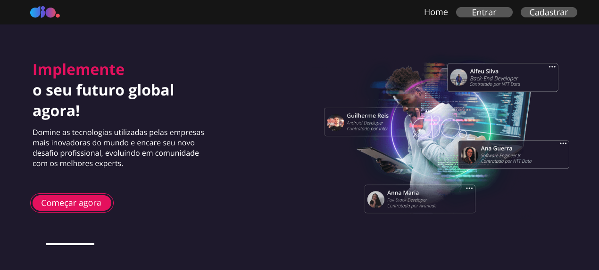

<h1 align="center">
  
</h1>

# DIO Clone

O objetivo desta aplicação é usar os conceitos aprendidos sobre React CLI, estilização com styled-components, Hooks e Formulários para criar uma tela de cadastro para a plataforma da Dio.

## Figma

O layout foi desenvolvido no Figma, no seguinte endereço:
https://www.figma.com/file/fvjQQNtqaUdpuNixvCZVav/DIO-CLONE?node-id=0%3A1
